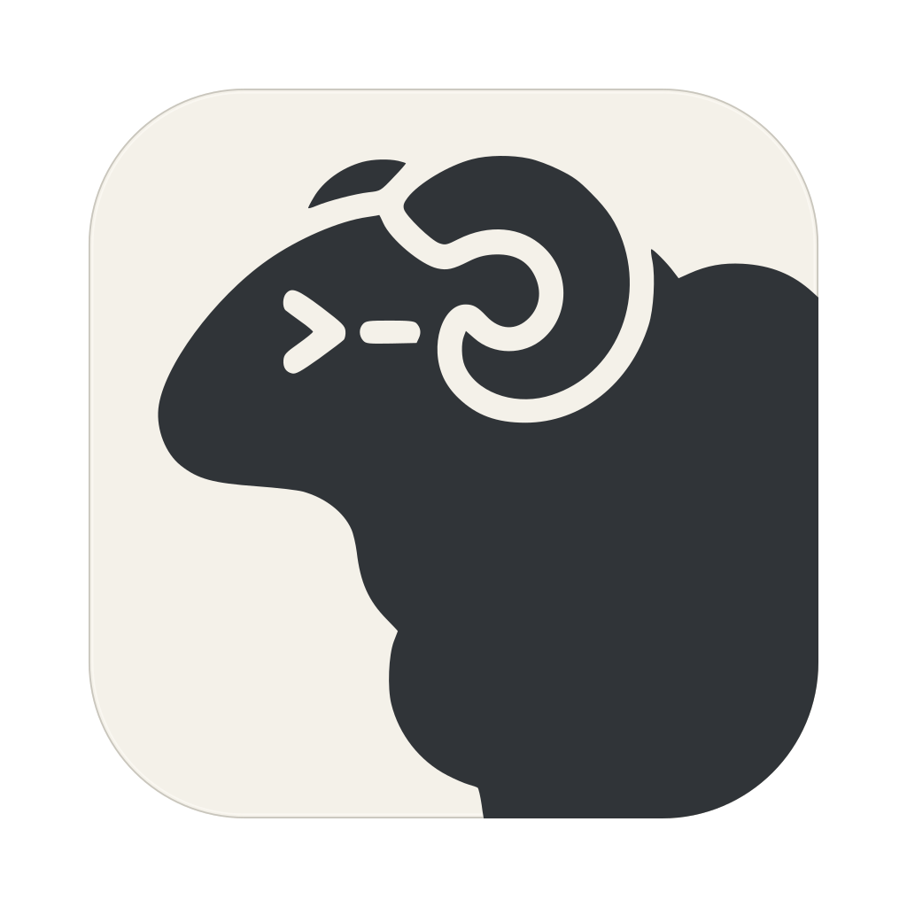
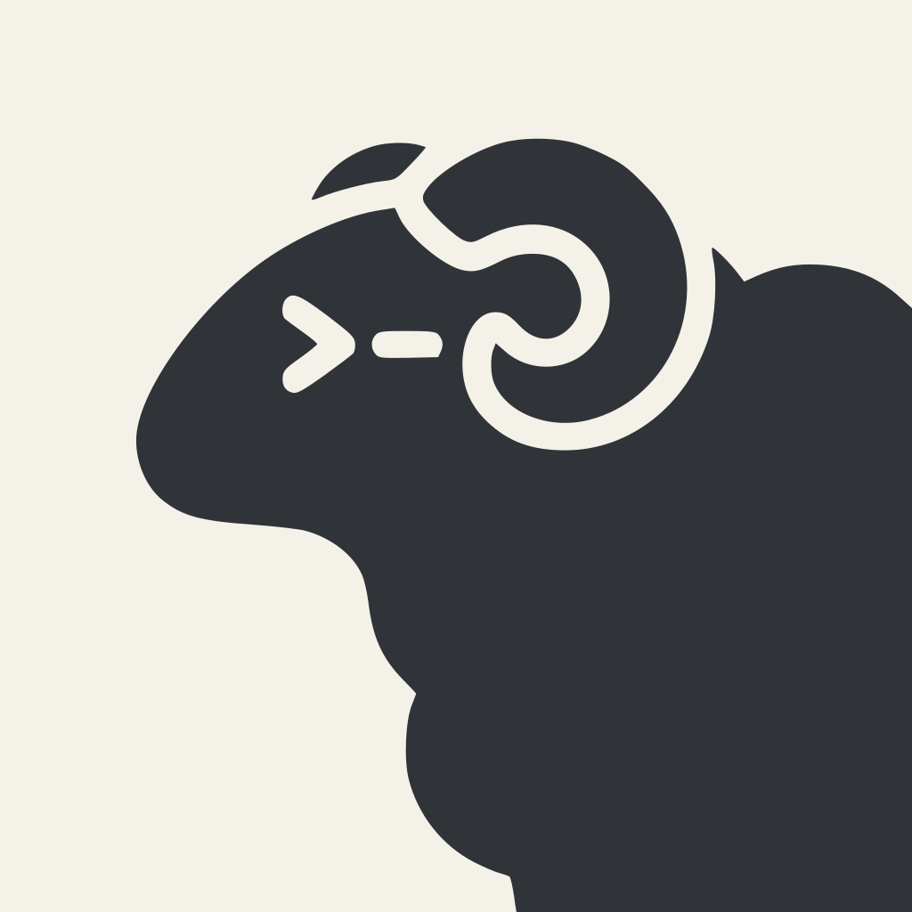

# Herdr Icon

The application icons combine Herdr's ram and terminal prompt with flat ivory
and graphite colors, without window controls, gradients, or shadows. The ram path is adapted from
[Herdr's logo](https://github.com/herdrdev/herdr/blob/HEAD/assets/logo.svg),
licensed under Apache-2.0. Changes include placement, scaling, flat colors,
and the surrounding tile. See the root [NOTICE](../../NOTICE)
and [LICENSE](../../LICENSE) for distribution attribution and license terms.
Transparent margins keep the rounded tile aligned with other macOS Dock icons.

| macOS / README | Linux |
| --- | --- |
|  |  |

`herdr-ui-icon-clean.svg` is the rounded tile source artwork;
`herdr-icon-square-clean.svg` is the full-square variant.
Their generated 1024x1024 PNG exports serve the README and About box
(rounded); Linux packages install the square SVG itself as the scalable icon.
On macOS, install the SVG renderer with
`brew install librsvg` and Xcode 26 or later, then run `just icons` after
changing either SVG.
The generator uses `rsvg-convert` to rasterize the vector artwork directly at
each iconset resolution, rather than downsampling a PNG, and Apple's `iconutil`
to package `Herdr.icns`. It also compiles `Herdr.car` (see below) and
regenerates the PNG exports.
Assets are checked in, so ordinary builds do not require Swift, librsvg, or Xcode.

### macOS sizing

The flattened `.icns` icons follow Apple's
[macOS Sequoia production template](https://devimages-cdn.apple.com/design/resources/download/macOS-Sequoia-Production-Templates-Sketch.dmg)
(`Template - Icon - App.sketch`). Its centered tile bounds are:

| Canvas (pixels) | Tile (pixels) | Margin on each side (pixels) |
| --- | --- | --- |
| 16 | 14 | 1 |
| 32 | 28 | 2 |
| 64 | 52 | 6 |
| 128 | 104 | 12 |
| 256 | 206 | 25 |
| 512 | 412 | 50 |
| 1024 | 824 | 100 |

The generator fits the source SVG's 896px rounded tile to these bounds before
rasterizing. Both the normal and red worktree icons use the same margins,
including the embedded 1024px PNG used by the About box. The full-square
Linux artwork uses its original canvas.

All five logical sizes (16, 32, 128, 256, 512) include 1x and Retina 2x
representations, as described in Apple's
[high-resolution iconset guidance](https://developer.apple.com/library/archive/documentation/GraphicsAnimation/Conceptual/HighResolutionOSX/Optimizing/Optimizing.html).
Run `swift scripts/check-icons.swift` on macOS to verify the committed PNGs and
every representation extracted from both `.icns` files.

### macOS 26 and later

macOS 26 and later redraw a flattened `.icns` with Liquid Glass lighting, which
softens its edges and shades its flat colors in the Dock. Bundles therefore also
ship `Herdr.car` as `Contents/Resources/Assets.car`, selected by
`CFBundleIconName`. The generator builds it from an
[Icon Composer](https://developer.apple.com/design/human-interface-guidelines/app-icons)
document: the ivory tile is the document's solid fill, and the ram path from
`herdr-ui-icon-clean.svg` becomes a full-bleed vector layer. Glass, specular
highlights, translucency, and shadows are off, preserving the flat design.
`xcrun actool` compiles the document and its flattened fallbacks for older
systems, under the icon name `Herdr` for both variants. Test the rendering with
`NSWorkspace.icon(forFile:)` on a bundle, or in the Dock.

The same generator uses CoreImage to map each rendered image's luminance to a red
palette, retaining transparency, producing `herdr-worktree-1024.png`,
`herdr-square-worktree-1024.png`, `Herdr-worktree.icns`, and
`Herdr-worktree.car`; the catalog's two flat colors pass through the same mapping.
These derived assets identify linked-worktree builds;
the normal artwork remains unchanged. macOS development runs select the embedded
multi-resolution `.icns` at compile time for the Dock, while macOS/Linux packaging reads the executable's build
identity to select the matching icon, even when packaging in another checkout.

`plus.svg` and `close.svg` are original tab-control artwork, reused by the
workspace menu alongside the original `pencil.svg` (rename), `trash.svg`
(delete checkout) and `chevron-up.svg` / `chevron-down.svg` (fold and unfold a
worktree group); `git-branch.svg` is original artwork for the titlebar's Git
actions button; `sessions.svg` is original artwork for the sidebar footer's local
session list; `teleport.svg` is original artwork for moving a worktree to
another host, and `teleport-back.svg` its mirror for bringing it back; `zoom.svg` is original artwork marking a zoomed tab in the tab strip; `window-minimize.svg`, `window-maximize.svg`, and `window-restore.svg` are original artwork for the window buttons drawn on Linux when the compositor provides none, beside `close.svg`; `user.svg` is an
original generic silhouette for the future account placeholder, not a personal
identity or GitHub logo. All of them are embedded through a
minimal GPUI asset source. GPUI renders them as SVG masks tinted with the current
theme foreground, rather than fixed-color cached images.

## Sidebar agent marks

Each `agent-<label>.svg` is named after Herdr's canonical `agent_label`
identifier in `src/detect/mod.rs`, not an editable display label. The
`agent_icons!` table in `crates/herdr-gpui/src/icons.rs` is the only mapping;
its test checks that every label Herdr emits has its own mark. Unknown, empty,
and missing identities use `agent-generic.svg`.

| Label | Source |
| --- | --- |
| `pi` | Lobe Icons `pi.svg` (Pi Agent, pi.dev) |
| `claude` | Lobe Icons `claude.svg` |
| `codex` | Lobe Icons `openai.svg` |
| `gemini` | Lobe Icons `gemini.svg` |
| `cursor` | Lobe Icons `cursor.svg` |
| `devin` | Lobe Icons `devin.svg` |
| `agy` | Lobe Icons `antigravity.svg` |
| `cline` | Lobe Icons `cline.svg` |
| `mastracode` | Lobe Icons `mastra.svg` |
| `opencode` | Lobe Icons `opencode.svg` |
| `copilot` | Lobe Icons `githubcopilot.svg` |
| `kimi` | Lobe Icons `kimi.svg` |
| `kiro` | Lobe Icons `kiro.svg` |
| `amp` | Lobe Icons `amp.svg` |
| `grok` | Lobe Icons `grok.svg` |
| `hermes` | Lobe Icons `hermesagent.svg` |
| `kilo` | Lobe Icons `kilocode.svg` |
| `qodercli` | Lobe Icons `qoder.svg` |
| `qwen` | Lobe Icons `qwen.svg` |
| `omp`, `droid`, `letta`, `maki` | Original lettermark (O, D, L, M) in a rounded square |
| `muse` | Original lettermark (M) in a circle, to tell it apart from Maki |
| generic | Original terminal artwork |

Lobe Icons marks are MIT licensed; source attribution and the full license are
in the root [NOTICE](../../NOTICE), shipped with releases. Their SVG wrappers
were reduced to a 24px `currentColor` mask and titles removed; paths are
unchanged. No redistributable monochrome mark was found for oh-my-pi, Factory
Droid, Letta, Maki, or Muse, so their lettermarks and the generic mark are
original artwork under this project's Apache-2.0 license, drawn with the same
2px round stroke as the generic mark. All are embedded SVG masks tinted with
the adjacent name's theme color.
